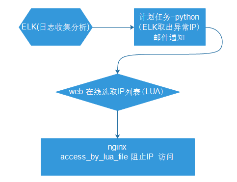
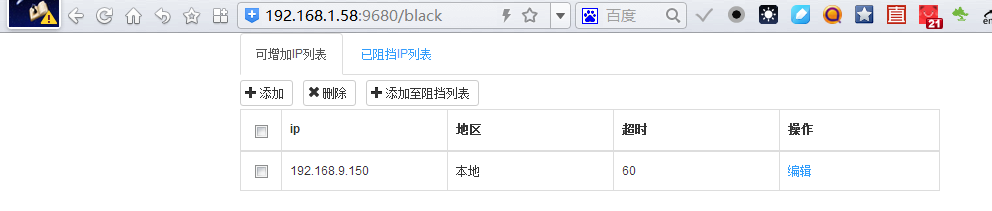
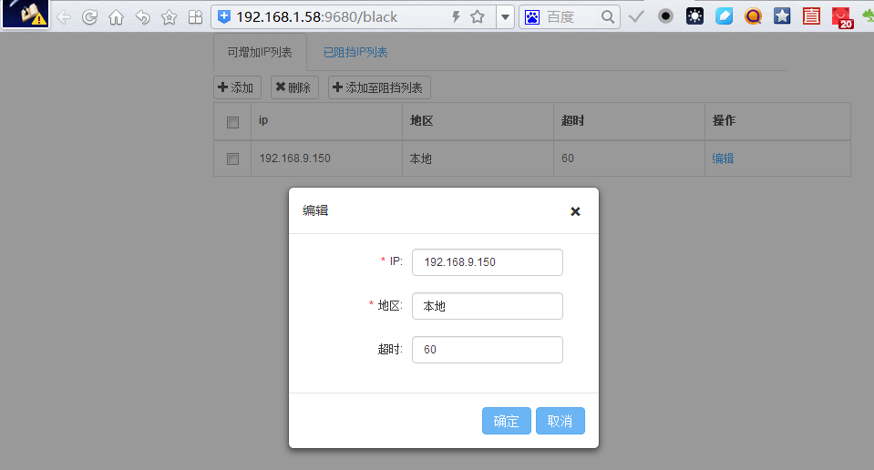
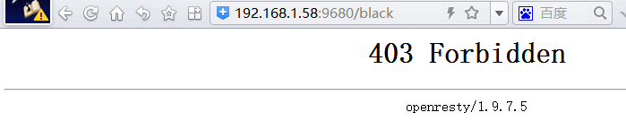

# ngx_web_blacklist
nginx web 在线增加 黑名单, 阻止访问

这是一个非常简单的应用基于 ngx_lua,代码也非常简单

### 主要实现

> 提供接口 动态增加 黑名单
>
> web 在线 查看 增加 删除黑名单
>
> 目前这里这要通过 elk,获取ip ,邮件通知后,web上确定后,才增加阻挡ip 访问

### 流程

### 配置安装

1. nginx 安装 lua 扩展   或使用 openresty ,需要 resty.template

2. 将目录拷呗至 nginx conf 目录

3. nginx.conf 增加 access_by_lua_file "conf/lua/access_limit.lua";

4. lua_shared_dict shared_ip 5m;

5. lua_shared_dict shared_blacklist_ip 5m;

6. 增加1个 location  名字随意

>location /black {
>
>​    default_type 'text/html'; 
>
>​    content_by_lua_file "conf/lua/black.lua";
>
>}

### 界面截图

> 通过接口把ip 增加至 *可增加ip列表*  ,确认后 点 *添加至阻挡列表* ,真正开始阻挡ip 访问

> 测试增加本机ip后,刷新 即出现 403拒绝访问

